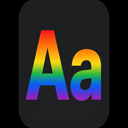

# Pride Flag Highlighter

<p align="center">
  
</p>

<p align="center">
  Paint LGBTQ+ identity words with their pride-flag colours — gradient text or underlines, hover labels, and a settings panel.
</p>

<p align="center">
  <a href="https://github.com/ExtraPotions/vivid-prism-heron/releases/latest"></a>
  <a href="https://github.com/ExtraPotions/vivid-prism-heron/releases"></a>
  <a href="https://github.com/ExtraPotions/vivid-prism-heron/stargazers"></a>
  <a href="https://github.com/ExtraPotions/vivid-prism-heron/network/members"></a>
  <a href="https://github.com/ExtraPotions/vivid-prism-heron/issues"></a>
  <a href="LICENSE"></a>
</p>

**Author:** [expDARE](https://github.com/ExtraPotions) · **Latest:** [v1.2.0](https://github.com/ExtraPotions/vivid-prism-heron/releases/tag/v1.2.0)

| Stat | Value |
|------|-------|
| Flag identities | **59** |
| Userscript | `pride-flag-highlighter.user.js` |
| Runs on | all sites (`*://*/*`) |
| Storage | `localStorage` only (`@grant none`) |

## Install

1. Install [Tampermonkey](https://www.tampermonkey.net/) or [Violentmonkey](https://violentmonkey.github.io/).
2. Download **`pride-flag-highlighter.user.js`** from the [latest release](https://github.com/ExtraPotions/vivid-prism-heron/releases/latest).
3. Open the file (or drag it into the extension dashboard) and save.
4. Browse as usual — matching words pick up flag colours.

Optional: open [`demo.html`](demo.html) locally to preview without an extension.

## Settings

Tap the **32×32** Aa button (bottom-right; slides left of other corner widgets if needed):

- Enable / disable highlighting  
- **Exclude this site** — skip highlights on the current host (button stays so you can undo)  
- Style: gradient text or underline  
- Hover labels on/off  
- Per-flag checklist  

Saved under `pride.flag-highlighter.settings`. A short toast appears after install or update.

## Customize flags

Edit the `FLAGS` array in the userscript:

```js
{
  id: 'example',
  label: 'Example',
  words: ['example', 'ex'],
  colors: ['#FF0000', '#00FF00', '#0000FF']
}
```

Bare `poly` is not matched — use `polysexual` / `polyamorous` / `polyam`.

## License

[CC BY-NC-SA 4.0](https://creativecommons.org/licenses/by-nc-sa/4.0/) — expDARE / ExtraPotions.

Includes adaptations of earlier CC BY-NC-SA material by Yeosangist (license notice only). Pride flag colours follow commonly published community designs.

## Changelog

See [GitHub Releases](https://github.com/ExtraPotions/vivid-prism-heron/releases) for downloadable versions and notes.
